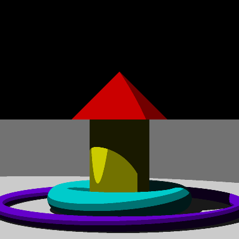
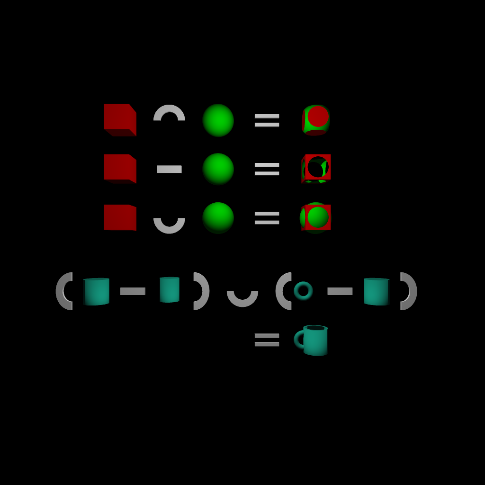
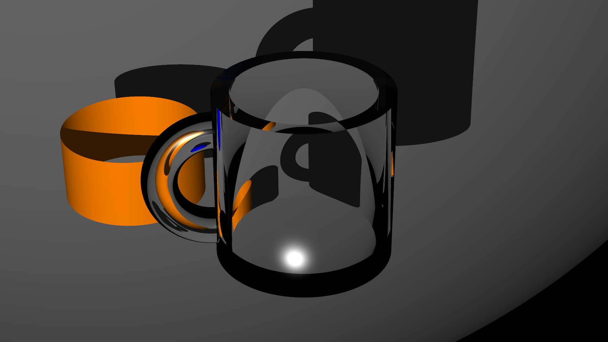

# List of features

## Cel shading

This ray tracer supports cel shading without outlines. A scene can specify an amount of shades to limit diffuse
lighting effects to, creating a cartoonish effect.

## Constructive Solid Geometry

Certain primitives can be combined in various ways. The union, intersection, and difference of these objects can be
taken in order to create more complex shapes.

## Transparent objects/refraction

Refraction is modeled for transparent objects, resulting in realistic-looking renditions of various transparent materials.

## Camera settings

Two types of camera are supported: orthographic and perspective. The camera's position and look direction, as well as
field of view for perspective cameras, can all be adjusted in scene files.

## Matrix transformation

All objects can be translated, rotated, and scaled without introducing extra mathematical complexity in the ray-intersect
functions of those primitives, through matrix transformation.