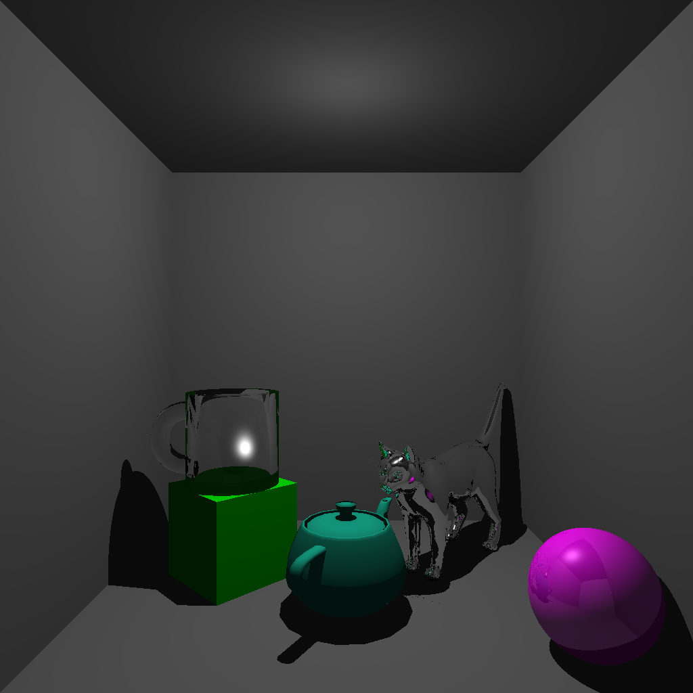
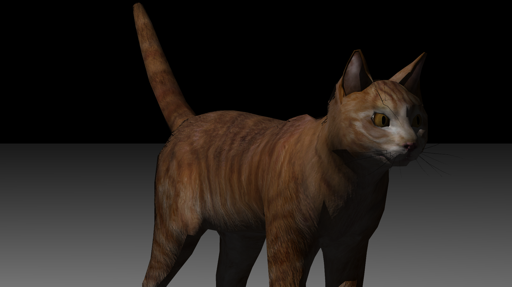

# List of features

## Cel shading

This ray tracer supports cel shading without outlines. A scene can specify an amount of shades to limit diffuse
lighting effects to, creating a cartoonish effect.

## Constructive Solid Geometry

Certain primitives can be combined in various ways. The union, intersection, and difference of these objects can be
taken in order to create more complex shapes.

## Transparent objects/refraction

Refraction is modeled for transparent objects, resulting in realistic-looking renditions of various transparent materials.

## Normal mapping

Normal mapping is implemented for more realistic-looking textures.

## Binary Space Partitioning

An algorithm is employed to partition space into parts using objects' bounding boxes, first checking
whether each ray hits some bounding box before checking whether it hits any given object.
This greatly speeds up the program for large amounts of objects, especially polygon meshes.

## Camera settings

Two types of camera are supported: orthographic and perspective. The camera's position and look direction, as well as
field of view for perspective cameras, can all be adjusted in scene files.

## Matrix transformation

All objects can be translated, rotated, and scaled without introducing extra mathematical complexity in the ray-intersect
functions of those primitives, through matrix transformation.